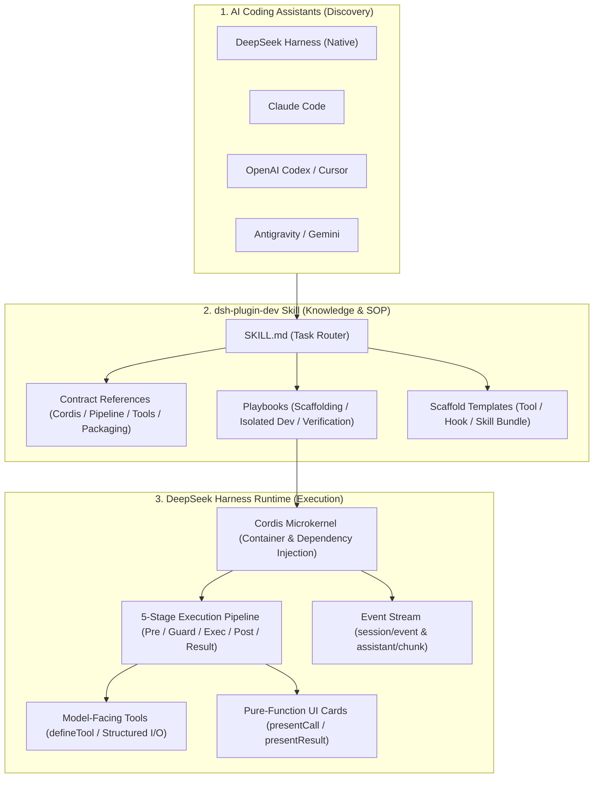

# dsh-skill · DeepSeek Harness Official Development Skill & Toolkit

[](LICENSE)
[](https://github.com/realchendahuang/dsh-skill/releases)
[](https://github.com/realchendahuang/dsh-skill/actions)
[](https://github.com/deepseek-ai/deepseek-harness)
[](https://github.com/realchendahuang/dsh-skill/pulls)
[](https://github.com/realchendahuang/dsh-skill)
[](https://github.com/realchendahuang/dsh-skill/network/members)
[](https://github.com/realchendahuang/dsh-skill/issues)
[](CODE_OF_CONDUCT.md)
[](https://x.com/realchendahuang)

> **Authoritative development kit and agent skill for DeepSeek Harness (DSH) plugins and extensions.**
> Grounded in official runtime contracts for Claude Code, Codex, Antigravity, Cursor, and DSH.

English | [中文](README.md)

---

## Quickstart & Installation

Get started instantly without manually looking up agent skill paths:

### Method 1: One-Line Script Installer (Recommended, Auto-Configures CLI)

**macOS / Linux / WSL:**
```bash
curl -fsSL https://raw.githubusercontent.com/realchendahuang/dsh-skill/main/install.sh | bash
```

**Windows (PowerShell):**
```powershell
irm https://raw.githubusercontent.com/realchendahuang/dsh-skill/main/install.ps1 | iex
```
> Automatically detects local environments, installs to DSH, Claude Code, Codex/Cursor, and Antigravity, and links the `dsh-skill` CLI to your PATH.

### Method 2: Via NPX
```bash
# Install skill and link CLI locally
npx github:realchendahuang/dsh-skill install

# Check platform installation status
npx github:realchendahuang/dsh-skill status
```

### Method 3: Native DSH Plugin (Cordis Layer Injection)
```bash
dsh plugin --profile web add git+https://github.com/realchendahuang/dsh-skill.git
```

---

## CLI Toolkit Usage

Once installed, run `dsh-skill` from any directory:

```bash
# 1. Check skill installation status across platforms
dsh-skill status

# 2. Scaffold a standard Tool Plugin (default)
dsh-skill init dsh-my-tools

# 3. Scaffold an Execution Guard & Security Hook Plugin
dsh-skill init dsh-my-guard --type hook

# 4. Scaffold an Agent Skill Bundle
dsh-skill init dsh-my-skill --type skill

# 5. Audit an existing plugin for DSH compliance and rule violations (8-step check)
dsh-skill check .

# 6. Refresh and update installed skills to latest release
dsh-skill update
```

---

## System Architecture & Workflow



---

## Why This Skill?

When AI coding assistants are asked to write a DSH plugin without structured engineering guidance, they frequently hit critical pitfalls:

- **Guessing the Microkernel Model**: Missing `inject` declarations or confusing Global vs Scoped Contexts in Cordis.
- **Bundling Runtime Packages**: Accidentally bundling `@deepseek-ai/*` into the output file, leading to broken prototypes and failed Symbol comparisons.
- **Corrupting User Environment**: Directly installing untested plugins into `~/.dsh`, causing host crashes.
- **Messing Up Output & UI**: Mixing model-visible natural language text with UI client cards instead of using canonical outputs and pure-function card intents.

**`dsh-skill` distills the official source contracts, execution pipeline stages, and isolated development SOP into an on-demand Agent Skill. Once loaded, your coding assistant follows the exact architectural blueprints.**

---

## Multi-Mode Architecture

### Mode 1: Universal Agent Skill (All Platforms)
Place `dsh-skill` into your agent's skill directory for instant discovery:
- DeepSeek Harness: `<projectRoot>/.dsh/skills/dsh-plugin-dev` or `~/.dsh/skills/dsh-plugin-dev`
- Claude Code: `~/.claude/skills/dsh-plugin-dev`
- OpenAI Codex: `~/.agents/skills/dsh-plugin-dev`
- Google Antigravity: `~/.gemini/config/skills/dsh-plugin-dev`

### Mode 2: DSH Cordis Plugin (`dsh plugin add`)
`dsh-skill` implements the official `dsh.bundle` and `cordis.patch.yml` manifest. Install it natively:
```bash
dsh plugin add dsh-skill
```
Upon startup, it dynamically registers `dsh-plugin-dev` into `ctx.skills`.

---

## Comprehensive Specifications & Assets

```text
dsh-skill/
├── SKILL.md                 # Core Agent skill entry and operational router
├── references/              # Architectural contracts extracted from DSH source
│   ├── cordis-runtime.md    # Cordis microkernel, apply contracts, and scoped contexts
│   ├── tools-contract.md    # defineTool, ParameterSchemaSpec, and pure-function UI cards
│   ├── execution-pipeline.md # 5-stage tool execution pipeline & lifecycle hooks
│   ├── skills-subsystem.md  # 6-rank discovery hierarchy and dynamic catalog disclosure
│   ├── ui-and-events.md     # session/event stream, assistant/chunk, and steering controls
│   ├── packaging-rules.md   # Externalization rules and package.json manifests
│   ├── plugin-testing.md    # Unit testing DSH plugins with context mocking
│   └── presets-and-subagents.md # Extending presets and custom subagent runners
├── playbooks/               # Agent Standard Operating Procedures (SOP)
│   ├── 01-scaffolding.md    # Project setup and bundling rules
│   ├── 02-tool-plugin.md    # Building a model tool
│   ├── 03-hook-plugin.md    # Implementing safety gates and execution interceptors
│   ├── 04-isolated-dev.md   # Safe local testing in isolated .dsh-dev
│   └── 05-verification.md   # Pre-publish checklist and pack review
├── templates/               # Minimal verified boilerplate code snippets
│   ├── tool-plugin/
│   ├── hook-plugin/
│   └── skill-bundle/
├── bin/                     # Cross-platform CLI (install, status, init, check)
├── CHANGELOG.md             # Semantic version history
├── CONTRIBUTING.md          # Contribution guidelines
├── SECURITY.md              # Security reporting policy
└── LICENSE                  # MIT License
```

---

## Ecosystem & History

- [Changelog](CHANGELOG.md)
- [DeepSeek Harness Official Repository](https://github.com/deepseek-ai/deepseek-harness)
- [Journey of a Message (dsh-guide)](https://chendahuang.com/dsh)

---

## Star History

[](https://star-history.com/#realchendahuang/dsh-skill&Date)

---

## License

[MIT License](LICENSE) · Copyright (c) 2026 [realchendahuang](https://github.com/realchendahuang)
