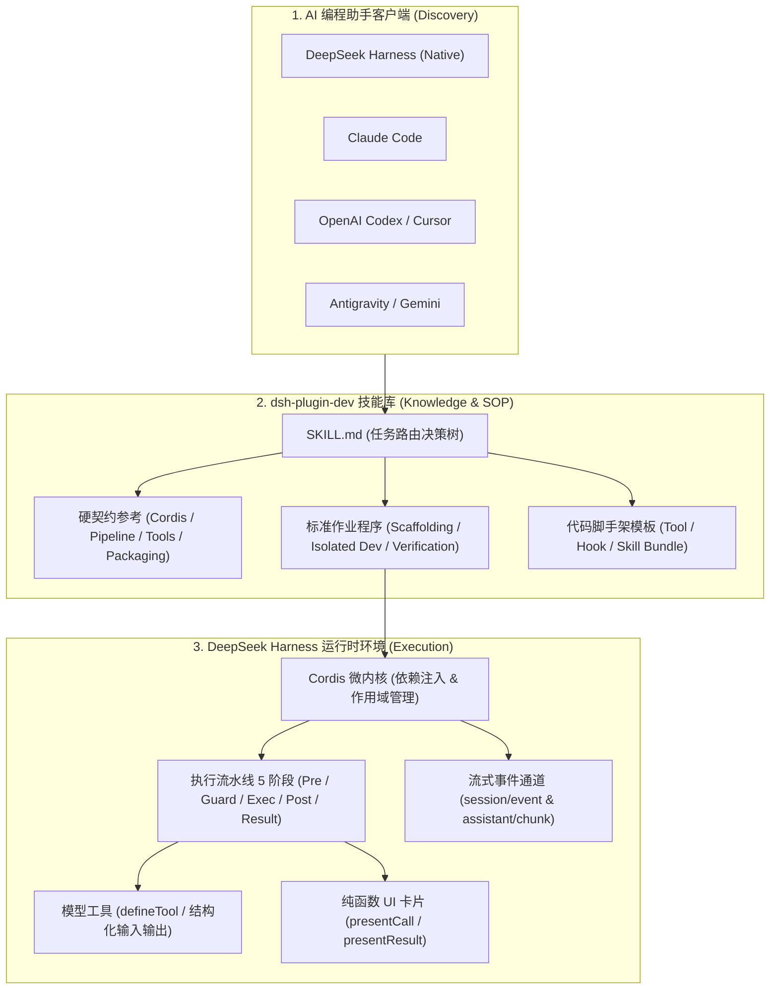

# dsh-skill · DeepSeek Harness 官方规范开发技能库

[](LICENSE)
[](https://github.com/realchendahuang/dsh-skill/releases)
[](https://github.com/realchendahuang/dsh-skill/actions)
[](https://github.com/deepseek-ai/deepseek-harness)
[](https://github.com/realchendahuang/dsh-skill/pulls)
[](https://github.com/realchendahuang/dsh-skill)
[](https://github.com/realchendahuang/dsh-skill/network/members)
[](https://github.com/realchendahuang/dsh-skill/issues)
[](CODE_OF_CONDUCT.md)
[](https://x.com/realchendahuang)

> **为 AI 编程助手（Claude Code、Codex、Antigravity、Cursor 及 DSH 自身）提供权威的 DeepSeek Harness 插件与扩展开发规范。**
> 支持作为 Agent 技能直接发现、作为 Cordis 插件动态挂载，或通过 CLI 一键安装。

[English](README.en.md) | [中文](README.md)

---

## 快速安装与上手

无需手动寻找各个 Agent 的技能安装路径，或者从零摸索脚手架，直接使用一键安装：

### 方式一：终端一行脚本静默直装（推荐，全自动部署与配置 CLI）

**macOS / Linux / WSL：**
```bash
curl -fsSL https://raw.githubusercontent.com/realchendahuang/dsh-skill/main/install.sh | bash
```

**Windows (PowerShell)：**
```powershell
irm https://raw.githubusercontent.com/realchendahuang/dsh-skill/main/install.ps1 | iex
```
> 自动识别本机环境，一键部署到 DSH、Claude Code、Codex/Cursor 与 Antigravity 技能目录，并自动链接 `dsh-skill` 命令行工具。

### 方式二：通过 NPX 运行
```bash
# 一键安装技能并链接 CLI 到本机
npx github:realchendahuang/dsh-skill install

# 检查当前各平台的安装状态
npx github:realchendahuang/dsh-skill status
```

### 方式三：DSH 原生插件机制（Cordis 动态挂载）
```bash
dsh plugin --profile web add git+https://github.com/realchendahuang/dsh-skill.git
```

---

## CLI 工具箱用法

安装完成后，直接在任意目录运行 `dsh-skill`：

```bash
# 1. 检查当前各平台的安装状态
dsh-skill status

# 2. 一键初始化一个全新的标准 DSH 插件项目（默认工具插件）
dsh-skill init dsh-my-tools

# 3. 初始化安全门禁钩子插件
dsh-skill init dsh-my-guard --type hook

# 4. 初始化独立 Agent 技能包
dsh-skill init dsh-my-skill --type skill

# 5. 诊断与校验已有插件的规范合规性（8 项硬契约质检）
dsh-skill check .

# 6. 一键更新所有平台的技能包到最新版本
dsh-skill update
```

---

## 系统架构与工作流全景



---

## 为什么需要这个 Skill？

让编程 Agent 写一个 DSH 插件时，最大的痛点往往是 **AI 在缺少工程约束的情况下到处碰运气**：

- **微内核与注入机制盲猜**：不知道底层基于 Cordis 容器，漏写 `inject` 或搞错全局与局部作用域。
- **打包配置翻车**：不知道 `@deepseek-ai/*` 属于运行时注入的内置依赖，直接把 `@deepseek-ai/cordis` 打包进单文件产物，导致原型链断裂和 Symbol 匹配失效。
- **宿主环境污染**：直接向日常使用的 `~/.dsh` 目录安装测试，把开发者的主配置搞崩。
- **输出与卡片混淆**：把面向模型的自然语言和 UI 客户端卡片混写在工具主体中，无法在流式生成和会话日志中干净回放。

**本仓库把官方源码中的架构契约、执行流水线与隔离开发测试流程，完整沉淀为标准 Agent 技能。装上之后，AI 编程助手将严格按规范输出代码，不再盲猜。**

---

## 运行形态：双模支持（Skill + Plugin）

为了满足不同开发者的使用习惯，本项目同时支持两种挂载形态：

### 形态 1：作为标准 Agent Skill（跨客户端通用）
将本仓库作为技能包置于各 Agent 客户端的技能目录中，Agent 即可自主调用：
- DSH 原生：`<projectRoot>/.dsh/skills/dsh-plugin-dev` 或 `~/.dsh/skills/dsh-plugin-dev`
- Claude Code：`~/.claude/skills/dsh-plugin-dev`
- Codex：`~/.agents/skills/dsh-plugin-dev`
- Google Antigravity：`~/.gemini/config/skills/dsh-plugin-dev`

### 形态 2：作为 DSH Cordis 插件（运行时动态注入）
本项目本身是一个合法的 Cordis 插件。可以在你的 `cordis.yml` 中直接声明：
```yaml
plugins:
  "dsh-skill": {}
```
在容器启动时，它会自动向 DSH 的 `ctx.skills` 注册表动态挂载 `dsh-plugin-dev` 技能，供当前会话中的 Agent 动态披露。

---

## 包含的官方规范与资产全景

```text
dsh-skill/
├── SKILL.md                 # 核心技能入口（Agent 读取此文件路由全流程）
├── references/              # 官方架构硬契约（基于 DeepSeek Harness 源码提炼）
│   ├── cordis-runtime.md    # Cordis 微内核、apply 契约、作用域与生命周期 Disposer
│   ├── tools-contract.md    # defineTool 规范、Schema 校验、纯函数 UI 卡片与超时取消
│   ├── execution-pipeline.md # 工具执行 5 阶段（pre-execute、guard、execute、post-execute、result）
│   ├── skills-subsystem.md  # 原生 Skills 体系、6 级 Rank 发现优先级与两阶段按需披露机制
│   ├── ui-and-events.md     # session/event 实时流式事件、assistant/chunk 与反向驱动
│   └── packaging-rules.md   # 外部化铁律、Host/Client 双端规范与 package.json 元数据
├── playbooks/               # Agent 标准作业程序（SOP）
│   ├── 01-scaffolding.md    # 从零初始化插件工程脚手架
│   ├── 02-tool-plugin.md    # 编写标准模型工具插件
│   ├── 03-hook-plugin.md    # 编写权限门禁与安全拦截钩子
│   ├── 04-isolated-dev.md   # .dsh-dev 本地隔离调试与冒烟测试
│   └── 05-verification.md   # 发版前严格质量质检与依赖排查清单
├── templates/               # 经过验证的最小可用模版代码
│   ├── tool-plugin/         # 基础工具插件骨架
│   ├── hook-plugin/         # 权限拦截门禁骨架
│   └── skill-bundle/        # 标准技能包骨架
├── bin/                     # CLI 跨平台一键安装工具
├── CHANGELOG.md             # 版本历史与变更记录
├── CONTRIBUTING.md          # 社区贡献指南
├── SECURITY.md              # 安全政策与漏洞汇报
└── LICENSE                  # MIT 开源协议
```

---

## 体验示例

安装后，直接对你的 AI 编程助手输入：

```text
帮我用官方规范开发一个 DSH 工具插件 dsh-curl-tools，提供发送 HTTP GET 请求的工具，并在本地隔离环境中完成测试。
```

Agent 会自动识别并加载本技能：
1. 建立符合规范的 `package.json` 并配置 esbuild 外部化依赖；
2. 编写基于 `defineTool` 的强类型参数校验与 UI 展示卡片；
3. 在 `.dsh-dev/` 隔离环境中启动测试，绝不修改日常配置；
4. 运行类型检查与产物审查后向你交付。

---

## 相关生态与版本历史

- [版本发布历史 (Changelog)](CHANGELOG.md)
- [DeepSeek Harness 官方仓库](https://github.com/deepseek-ai/deepseek-harness)
- [dsh-guide (一条消息的旅行 · 交互式源码解析)](https://chendahuang.com/dsh)

---

## Star History

[](https://star-history.com/#realchendahuang/dsh-skill&Date)

---

## License

[MIT License](LICENSE) · Copyright (c) 2026 [realchendahuang](https://github.com/realchendahuang)
