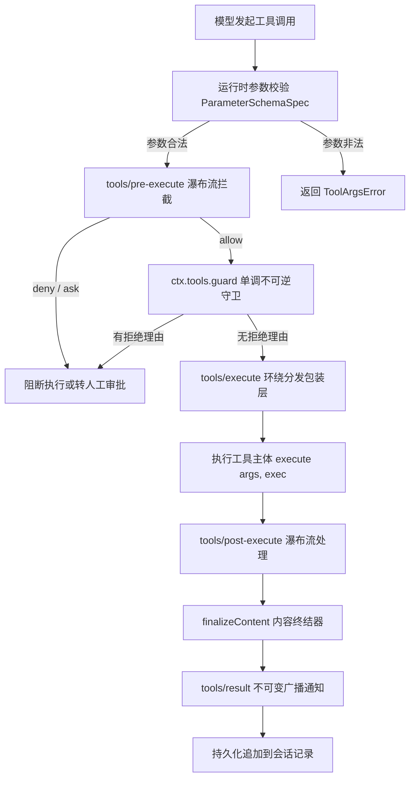

# DSH 执行流水线与钩子拦截点（Execution Pipeline & Hooks）

DSH 的工具调用与 Agent 决策不是简单的黑盒循环，而是通过微内核事件总线串联起来的确定性流水线。

## 1. 工具执行完整流水线（Tool Execution Pipeline）

每次工具调用依次穿透以下阶段：

### 阶段一：前置拦截门禁（`tools/pre-execute`）
- **职责**：策略层，用于实现动态权限、沙箱判定、用户反问等。
- **返回形态**：
  - `{ kind: 'allow' }`：允许进入下一阶段。
  - `{ kind: 'deny', reason: string }`：明确拒绝，阻断工具调用。
  - `{ kind: 'ask', reason?: string }`：唤起交互审批（需接入 `ctx.approval`），由用户在界面上批准或驳回。
- **限制**：此阶段不允许修改参数（防止参数与执行记录失真）。

### 阶段二：单调同步守卫（`ctx.tools.guard`）
- 在 `pre-execute` 之后执行的硬性守卫：`(exec) => string | undefined`。
- 如果返回拒绝原因字符串，则调用被绝对拒绝；**后续任何监听器都无法将该拒绝撤销**。

### 阶段三：分发环绕包装（`tools/execute`）
- **职责**：用于超时控制、失败重试、耗时打点与分布式追踪。
- **特征**：包裹实际的分发生命周期，可以替换并管理 `exec.signal`（例如附加超时截止信号）。

### 阶段四：后置处理（`tools/post-execute`）
- **职责**：在工具返回规范值后介入。
- **能力**：
  - 替换面向模型的展示内容 `content`；
  - 替换规范值 `value`（触发重新验证与重新渲染）；
  - 追加上下文消息 `additionalContexts`；
  - 阻止（block）该结果，转为错误。

### 阶段五：不可变观测（`tools/result`）
- 接收流水线最终的权威结果。
- **纯观察者模式**：仅用于审计、分析指标采集、遥测日志记录，无法更改或否决结果。

---

## 2. 常见生命周期钩子（Session & Agent Hooks）

DSH 在会话和代理循环的关键节点暴露了标准事件：

| 事件名称 | 触发时机 | 典型用途 |
|---|---|---|
| `agent/session-start` | 会话初始化或恢复时 | 注入初始环境变量、工作区配置检查 |
| `agent/pre-step` | 每一轮模型推理前 | 动态检查上下文水位、更新系统提示词片段、刷新动态技能目录 |
| `agent/turn-stopping` | 当前轮次即将收尾时 | 自动引导（Steering）、多轮自检与任务验收判断 |
| `skills/change` | 技能文件增删变动时 | 触发提供方重载与目录摘要 digest 重新计算 |
| `session/event` | 实时事件总线 | 监听 `assistant/chunk` 流式输出、工具活动与步骤流转 |
